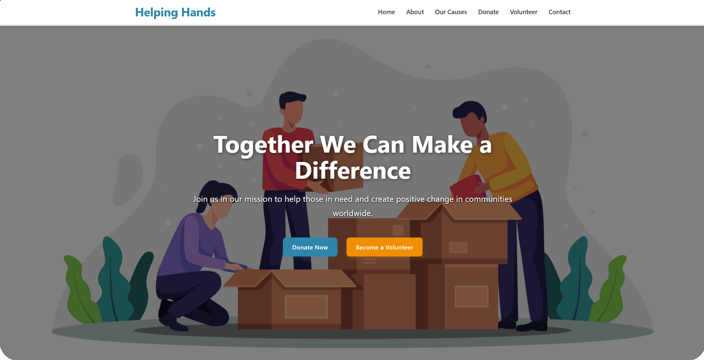

# Charity Website - Created for Client

## Helping Hands - Charity Website (React)

A fully responsive charity/non-profit website built with React, featuring donation functionality, volunteer sign-up, and multiple informational pages.

## 📸 Preview



## 🌟 Features

- **Responsive Design**: Works on all device sizes
- **Interactive Forms**: Donation and Volunteer forms with validation
- **Multiple Pages**:
  - Homepage with hero section and call-to-action
  - About Us with organization story and values
  - Causes/Programs with progress tracking
  - Donation page with secure payment form
  - Volunteer application page
  - Contact page with form and information
- **Modern UI**: Clean design with animations and hover effects
- **Accessibility**: Semantic HTML and proper contrast ratios

## 🛠️ Technologies Used

- React.js (v18+)
- React Router (v6+)
- React Icons
- CSS3 (Flexbox, Grid, Variables)
- Responsive Design (Mobile-first approach)

## 🚀 Getting Started

### Prerequisites

- Node.js (v14+)
- npm (v6+) or yarn

### Installation

1. Clone the repository:
   ```bash
   git clone https://github.com/your-username/charity-website-react.git
   cd charity-website-react
   ```

````

2. Install dependencies:

   ```bash
   npm install
   # or
   yarn install
   ```

3. Start the development server:

   ```bash
   npm start
   # or
   yarn start
   ```

4. Open [http://localhost:3000](http://localhost:3000) in your browser.

## 📂 Project Structure

```
charity-website/
├── public/               # Static files
│   ├── index.html
│   ├── favicon.ico
│   └── images/           # All website images
├── src/
│   ├── components/       # Reusable components
│   │   ├── images/
│   │   ├── Header.jsx
│   │   ├── Footer.jsx
│   │   ├── DonationForm.jsx
│   │   ├── VolunteerForm.jsx
│   │   ├── Testimonials.jsx
│   │   └── Causes.jsx
│   │   └── ScrollToTop.js
│   ├── pages/            # Page components
│   │   ├── images/
│   │   ├── Home.jsx
│   │   ├── About.jsx
│   │   ├── Causes.jsx
│   │   ├── Donate.jsx
│   │   ├── Volunteer.jsx
│   │   └── Contact.jsx
│   ├── App.js            # Main App component
│   ├── index.js          # Entry point
│   ├── App.css           # Main styles
│   └── index.css         # Global styles
├── package.json
└── README.md
```

## 🔧 Available Scripts

- `npm start`: Runs the app in development mode
- `npm test`: Launches the test runner
- `npm run build`: Builds the app for production
- `npm run eject`: Ejects from Create React App (advanced)

## 🌍 Deployment

The easiest way to deploy this React app is using [Vercel](https://vercel.com/) or [Netlify]

## 📝 License

This project is licensed under the MIT License.

## 🙏 Acknowledgments

- React documentation
- Create React App
- Various open-source UI libraries for inspiration

```

## 📌 **Repository Description** (GitHub repo "About" section)

```

A responsive charity/non-profit website built with React featuring:

- Multiple pages (Home, About, Causes, Donate, Volunteer, Contact)
- Interactive donation and volunteer forms
- Responsive design for all devices
- Clean, accessible UI with modern CSS
- Easy to customize for any non-profit organization

Perfect for:

- Charities looking for a modern web presence
- Developers learning React and responsive design
- Non-profits needing a customizable template

```

---

## Author

**Haider**
Built with ❤️ using React + Express
[GitHub Profile](https://github.com/HSA-ATTOCK)

---
```
````
